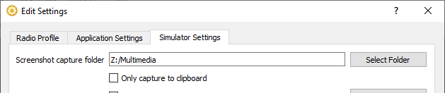
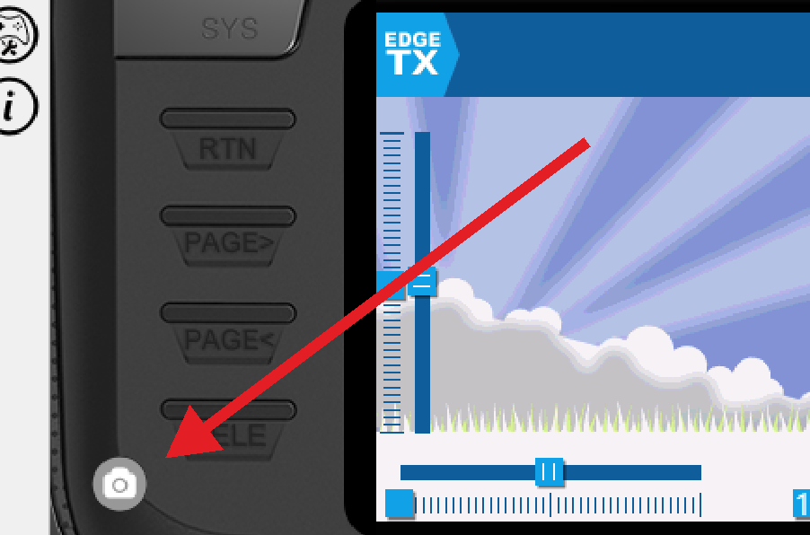

# Contributing to EdgeTX Themes

## Community standards

As a community project run by volunteers, we ask all contributors to:

- Keep content family-friendly — young people are part of this community
- Ensure your theme complies with [GitHub's acceptable use policies](https://docs.github.com/en/site-policy/acceptable-use-policies/github-hate-speech-and-discrimination)
- Be polite and respectful to everyone

We reserve the right to decline submissions that involve sexism, hate speech, racism, or political content.

## Creating a new theme

New themes are always welcome! Before submitting, please note that the EdgeTX theme specification is still evolving — you may be asked to update your submission if the spec changes (e.g. image sizes or YAML structure).

When creating your theme:

1. Review [structure.md](structure.md) for the required file layout and YAML format
2. Ensure your theme folder includes all 5 required files (`theme.yml`, `logo.png`, `screenshot1.png`, `screenshot2.png`, `screenshot3.png`)
3. Complete the checklist in the pull request template before submitting

### Taking screenshots with the EdgeTX Simulator

The easiest way to produce screenshots is with the EdgeTX Simulator built into [EdgeTX Companion](http://edgetx.org/getedgetx.html#:~:text=Looking%20for%20EdgeTX%20Companion%3F).

First, configure the screenshot output folder. In Companion, open `Settings` → `Settings...`, navigate to the **Simulator Settings** tab, and set a folder for screenshots:



Then, while running the simulator, click the Screenshot icon to capture the current screen:



## Validating your theme locally

Before submitting, you can run the same validation checks that CI will run on your pull request.

**Prerequisites:** [Python 3.10+](https://www.python.org/) and [uv](https://docs.astral.sh/uv/getting-started/installation/).

From the root of the repository, run:

```sh
# Create/update the project virtual environment
uv sync

# Validate all themes
uv run tools/validate_themes.py

# Validate only your theme
uv run tools/validate_themes.py --theme my-new-theme
```

This installs dependencies from `pyproject.toml` into `.venv`, which keeps CLI tooling and VS Code/Pylance on the same environment.

**Errors** must be fixed before a PR can merge — these include a missing or unparseable `theme.yml`, missing required color keys, invalid color values, or missing required image files (`logo.png`, `screenshot1.png`–`screenshot3.png`).

**Warnings** flag things that are allowed but worth knowing about, such as missing background resolution variants or the optional `QM_BG`/`QM_FG` color keys added in EdgeTX 2.12. Use `--strict` to treat warnings as errors.

## Submitting your theme

1. If you don't yet have a GitHub account, [create one](https://github.com/join) (it's free)
2. Fork this repo by clicking **Fork** in the upper right
3. Create a branch — click the down arrow next to "main", type a name without spaces (e.g. `my-new-theme`), and click **Create branch**
4. Commit your theme folder to your branch.
   You can work via the GitHub web interface, or locally:
   ```sh
   git clone -b my-new-theme https://github.com/your_username/themes.git ~/edgetx/themes
   git add THEMES/my-new-theme/
   git commit -m "feat: add My New Theme"
   git push
   ```
   Windows users looking for a graphical Git client can try [TortoiseGit](https://tortoisegit.org/).
5. Open a pull request by clicking the **Compare & Pull Request** button in your fork

## Did you find a bug in a theme?

- Check whether it's already been reported under [Issues](https://github.com/EdgeTX/themes/issues)
- If not, [open a new issue](https://github.com/EdgeTX/themes/issues/new) with a clear title, description, and any relevant details

## Did you write a patch that fixes a bug?

- Open a new pull request with the fix
- Describe the problem and solution clearly in the PR description, and include the issue number if applicable

## Cosmetic-only changes

Changes that are cosmetic in nature and do not add anything substantial will generally not be accepted.
