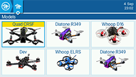
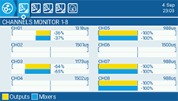

# Themes directory for third party themes for EdgeTX

- Contents (ToC):
  * [List of themes available](#list-of-themes-available)
  * [Description of an EdgeTX theme](#description-of-an-edgetx-theme)
  * [Steps to contribute](#steps-to-contribute)

## List of themes available

### RCVR_Halloween
  

### ingage_purps
  

### ingage_pastel
  

### ingage_carbon
  

### RCVR_High_Contrast
   

## Description of an EdgeTX theme

*Initial Draft Specification - subject to change!*

A theme for EdgeTX consists minimally of 5 files, all sharing the initial part of the filename (**themefile** in this example):
  - **themefile**.yml (you theme configuration file with name, summary, and color settings)
  - **themefile**.png (a logo/banner for your theme) 
    
  - **themefile**1.png (first screenshot, of the main screen with some common widgets selected) 
    
  - **themefile**2.png (second screenshot, of model selection screen with at least two models present) 
    
  - **themefile**3.png (third screenshot, of the channel monitor) 
    

Optional:
  - **themefile**_bg_480x272.png (a background image for your theme in 480 x 272 pixel resolution, e.g. for TX16S, T16, X10, X12S)
  - **themefile**_bg_320x480.png (a background image for your theme in 320 x 480 pixel resolution, e.g. for NV14)
  - **themefile**_readme.txt (any notes or information you wish to share with your theme)

Images should all be in PNG format, and 225 x 128 pixels in size, except the optional background image(s).

Please refer to the `example` folder for an example of the expected layout.

Please refer to TODO documentation for more information on the theme file format.

## Steps to contribute

Please note that themes are currently still in development phase in EdgeTX and the specification can change. Thus please be prepared that at some point in (near) future you might be asked to update your submission, as we change the specification, e.g. about the image size or YAML style required.

If you want to contribute at current early stage in spite of the warning above, here are the steps:
<ol>
  <li>If you do not yet have a GitHub account, create it (it is free)</li>
  <li>Fork this repo by clicking <code>Fork</code> in upper right</li>
  <li>Make a branch (by clicking down arrow at "main" and typing an arbitrary name without spaces, e.g. "mytesttheme" and clicking "Create branch")</li>
  <li>Commit your changes to your newly created branch.
     You can work via GitHub Web interface or optionally you can do this also locally. Instructions for local command line would be:
     <code>git clone -b mytesttheme https://github.com/your_user_name_in_GitHub/themes.git ~/edgetx/themes</code>
     Then add the files with <code>git add</code>, followed by a commit with <code>git commit -m "commitmessagehere"</code> and then push with <code>git push</code>
   If you are a Windows user and looking for a graphical tool for Git, have a look at e.g. <a href="https://tortoisegit.org/">TortoiseGit</a></li>
  <li>Make a pull request by clicking the big green "Compare & Pull Request" button in GitHub in your fork's branch.</li>
</ol>
