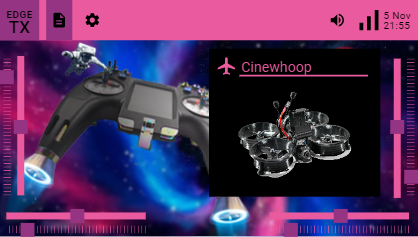
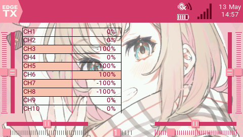
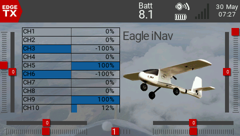
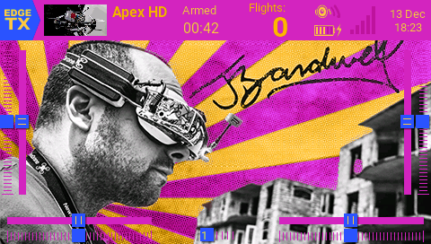
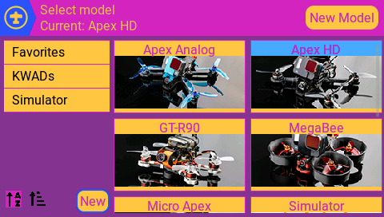
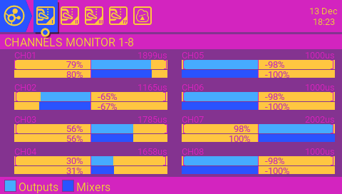

# Themes directory for third party themes for EdgeTX

For older, EdgeTX v2.5 compatible themes, please [go to the 2.5 branch](../../tree/2.5).

[Click here](https://github.com/EdgeTX/themes/releases/download/latest/edgetx-themes.zip) to download the latest themes package which you can then copy onto your radios SD card. Alternately, if you want to see what the latest changes were, check the [latest release](https://github.com/EdgeTX/themes/releases/tag/latest) page.

**Contents (ToC):**
- [Online theme creators](#online-theme-creators)
- [List of themes available](#list-of-themes-available)
- [Description of an EdgeTX theme](#description-of-an-edgetx-theme)
- [Steps to contribute](#steps-to-contribute)

## Online theme creators
You have an option to create themes with easy-to-use online theme file creators:
- [EdgeTX Theme Creator](https://edriskus.github.io/edgetx-theme-creator/) by edriskus
- [EdgeTX Theme yml thingie](https://qwad.se/edgetx-theme-yml-thingie/) by Mattias Kallio

Both let you play with the theme colours and generate the required files.

## List of themes available

### RCVR Cool Blue
  

### RCVR_Christmas
  

### RCVR_Halloween
  

### RCVR_High_Contrast
  

### RCVR_USA
  

### InGage_coffee
  

### InGage_espresso
  

### InGage_purps
  

### InGage_carbon
  

### InGage_poke
  

### InGage_pastel
  

### Stroopwafel
  

### SimpleRed
  

### RL_Extravagant
  

### RL_BurgundyRed
  

### D.Va Pink
  

### Nia_vibrant_blue
  

### Handpainted Sky
  

### Nirvana Smoke
  

### Nirvana Space
  

###  Rammstein inspired theme
  

### FM2M Original
  

### FM2M Concrete
  

### FM2M Green Fields
  

### FM2M Hell Yeah
  

### FM2M Vineyard
  

### RK-Cappuccino
  

### burn7_AnimePink
  

### Bonafidepirate
  

### Grown Up
  

### Brushed Aluminum
  

### RotorOxio Gold&Blood!
  

### Wolfman
  

### DZARO Dark Purple
  

### GhostBranchFPV
  

### FPV Know It All
  

### Ghost in the Machine
  

### JWST-Pillars
  

## Description of an EdgeTX theme

A theme for EdgeTX consists minimally of 5 files, all located in a dedicated subfolder (in the example here `themename`):
  - **themename/theme**.yml (your theme configuration file with name, summary, and color settings)
  - **themename/logo**.png (a logo/banner for your theme) 
    
  - **themename/screenshot1.png** (first screenshot, of the main screen with some common widgets selected) 
    
  - **themename/screenshot2.png** (second screenshot, of model selection screen with at least two models present) 
    
  - **themename/screenshot3.png** (third screenshot, of the channel monitor, or alternately, Radio/Hardware tab where warning text color shown) 
    

Optional:
  - **themename/background_480x272.png** (a background image for your theme in 480 x 272 pixel resolution, e.g. for TX16S, T16, X10, X12S)
  - **themename/background_480x320.png** (a background image for your theme in 480 x 320 pixel resolution, e.g. for PL18)
  - **themename/background_320x480.png** (a background image for your theme in 320 x 480 pixel resolution, e.g. for NV14)
  - **themename/readme.txt** (any notes or information you wish to share with your theme)

Images should all be in PNG format, and 480x272 pixels in size, except the optional 320x480 and 480x320 background images.

Please refer to the `example` folder for an example of the expected layout.

Please refer to [theme documentation](structure.md) for more information on the theme file format.

## Steps to contribute

Please note that themes are currently still in development phase in EdgeTX and the specification can change. Thus please be prepared that at some point in (near) future you might be asked to update your submission, as we change the specification, e.g. about the image size or YAML style required.

In order to take screenshots using the EdgeTX simulator, first start [EdgeTX Companion](http://edgetx.org/getedgetx.html#:~:text=Looking%20for%20EdgeTX%20Companion%3F), pick from menu `Settings` the menu item with similar name `Settings...`
Navigate to `Simulator Settings` tab and provide a folder where you would like the simulator to save the images (here in example `Z:\Multimedia`):

When using EdgeTX Simulator, click on the Screenshot icon to take a screenshot:

If you want to contribute at current early stage in spite of the warning above, here are the steps:
<ol>
  <li>If you do not yet have a GitHub account, create it (it is free)</li>
  <li>Fork this repo by clicking <code>Fork</code> in upper right</li>
  <li>Make a branch (by clicking down arrow at "main" and typing an arbitrary name without spaces, e.g. "mytesttheme" and clicking "Create branch")</li>
  <li>Commit your changes to your newly created branch.
     You can work via GitHub Web interface or optionally you can do this also locally. Instructions for local command line would be:
     <code>git clone -b mytesttheme https://github.com/your_user_name_in_GitHub/themes.git ~/edgetx/themes</code>
     Then add the files with <code>git add</code>, followed by a commit with <code>git commit -m "commitmessagehere"</code> and then push with <code>git push</code>
   If you are a Windows user and looking for a graphical tool for Git, have a look at e.g. <a href="https://tortoisegit.org/">TortoiseGit</a></li>
  <li>Make a pull request by clicking the big green "Compare & Pull Request" button in GitHub in your fork's branch.</li>
</ol>
