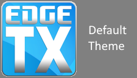
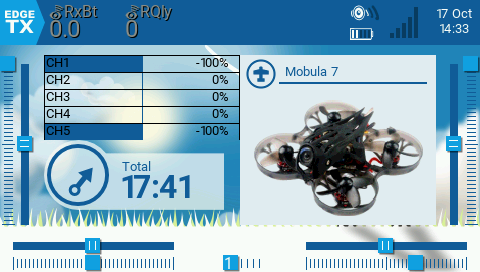
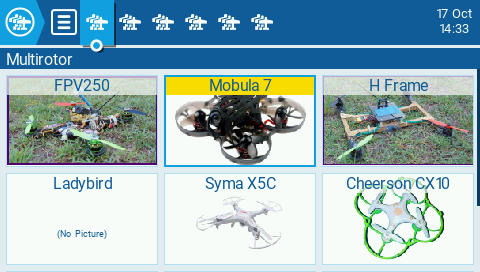
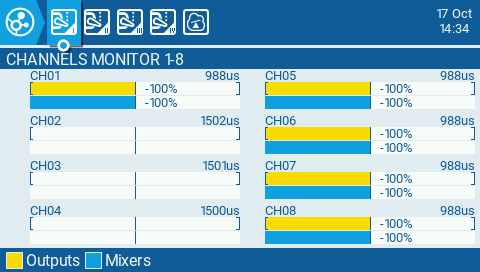

# EdgeTX Theme Documentation

## Theme file structure

A theme consists of a dedicated folder placed in the `/THEMES/` directory on your radio's SD card. The folder must contain these 5 required files:

- **theme.yml** — the theme configuration file (name, author, info, and color settings)
- **logo.png** — a logo/banner image displayed in the EdgeTX theme selector</br>
  
- **screenshot1.png** — first screenshot, of the main screen with some common widgets selected</br>
  
- **screenshot2.png** — second screenshot, of the model selection screen with at least two models present</br>
  
- **screenshot3.png** — third screenshot, of the channel monitor or Radio/Hardware tab showing warning text color</br>
  

Screenshots and logo should be PNG format. Screenshots are typically 480×272 pixels.

Optional files:

- **background_320x240.png** — background image for 320×240 displays (e.g. PA01)
- **background_320x480.png** — background image for 320×480 displays (e.g. EL18, NV14)
- **background_480x272.png** — background image for 480×272 displays (e.g. TX16S, T16, X10, X12S)
- **background_480x320.png** — background image for 480×320 displays (e.g. PL18, PL18EV, T15)
- **background_800x480.png** — background image for 800×480 displays (e.g. TX16S MK3)
- **readme.txt** — any notes or information you wish to include with your theme

Please refer to the `example` folder for a reference theme layout.

---

## Color variables

There are 11 EdgeTX OS color variables that define the UI look & feel: PRIMARY1, PRIMARY2, PRIMARY3, SECONDARY1, SECONDARY2, SECONDARY3, FOCUS, EDIT, ACTIVE, WARNING, and DISABLED.

Color values use a 24-bit RGB scheme coded in hex format RRGGBB, where RR is the red component, GG is green, and BB is blue. Each component ranges from 00–FF.

Examples:

- `FF0000` — light red
- `440000` — dark red
- `00FF00` — light green
- `002400` — dark green
- `0000FF` — light blue
- `000064` — dark blue
- `FFFFFF` — white
- `808080` — 50% gray
- `202020` — dark gray

---

## Theme YAML file structure

Colors are stored in a YAML file called `theme.yml` in your theme folder. YAML is a simple text format editable in any text editor.

Example:

```yml
---
summary:
  name: Theme name
  author: Creator
  info: Short description here
colors:
  PRIMARY1:   0xA0A0A0
  PRIMARY2:   0x202020
  PRIMARY3:   0x505050
  SECONDARY1: 0x808080
  SECONDARY2: 0x505050
  SECONDARY3: 0x303030
  FOCUS:      0xC0C0C0
  EDIT:       0xEEEEEE
  ACTIVE:     0xD0D0D0
  WARNING:    0x404040
  DISABLED:   0x808080
```

Syntax breakdown:

```
---          YAML document marker (must be the first line)
summary:     Group: theme metadata
  name:      Theme name shown in EdgeTX UI
  author:    Author name shown in EdgeTX UI
  info:      Short description shown in EdgeTX UI
colors:      Group: color definitions
  PRIMARY1:  Color value in 0xRRGGBB format
  ...
```

The optional `description:` field may also appear under `summary:` for a longer description not shown in the UI.

In addition to `0xRRGGBB` hex notation, colors can be specified using the `RGB()` function in decimal:
`SECONDARY1: RGB(128, 128, 128)` or `SECONDARY1: RGB(0x80, 0x80, 0x80)`

---

## Color assignments for UI elements

```
PRIMARY1
  Label text
  Button text (not focused)

PRIMARY2
  ETX Logo icon
  TopBar icons
  TopBar text
  TopBar tab name text
  BottomBar text
  Editable field background
  Editable field text (editing)
  Button text (focused)
  PopUp selectable field background
  Trim knob
  Slider knob

PRIMARY3
  Scroll marker
  Inactive part of TopBar icons

SECONDARY1
  TopBar background
  BottomBar background
  Trim knob path
  Trim knob shadow
  Slider path
  Slider knob shadow

SECONDARY2
  Label background
  Button background

SECONDARY3
  Main screen background
  PopUp background

FOCUS
  ETX Logo background
  TopBar icon background (selected)
  Label background (focused)
  Editable field background (focused)
  Trim knob
  Slider knob

EDIT
  Editable field background (editing)

ACTIVE
  Button background (active)
  Editable field background (variable active)

WARNING
  Label text (warning)

DISABLED
  Disabled elements
```
